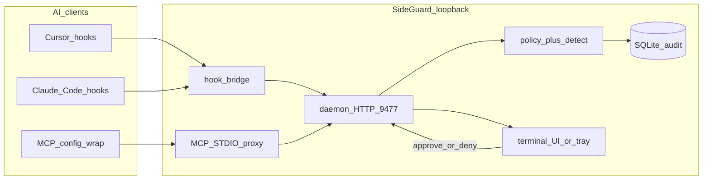

# SideGuard — Architecture

> Audience: contributors, security reviewers, and technical evaluators

## Overview

SideGuard is a **local security layer** for AI coding agents (Cursor, Claude Code). It intercepts **shell commands** and **MCP tool calls** before they execute on the host, evaluates them against YAML policy, and holds risky actions in a human-in-the-loop approval queue. Everything runs on loopback — no cloud proxy required.

The implementation ships as a **single Go binary** (daemon, CLI, hook bridge, MCP STDIO proxy, terminal TUI, optional macOS menu-bar tray) plus a **Vite + React** marketing site at [sideguard.io](https://sideguard.io).

## Components

| Path | Responsibility |
| --- | --- |
| `cmd/sideguard/` | Cobra CLI: `install`, `daemon`, `ui`, `hook`, `wrap`, `history`, `update`, `llm`, `tray` |
| `internal/daemon/` | User-session daemon: HTTP API on `127.0.0.1:9477`, approval queue, mode persistence |
| `internal/hook/` | Blocking Cursor/Claude hook bridge: stdin JSON → policy → long-poll approval → stdout |
| `internal/proxy/` | MCP STDIO proxy: passthrough for safe methods; hold `tools/call` for approval |
| `internal/policy/` | YAML load/evaluate: auto-allow, auto-deny, ask; workspace dev overrides |
| `internal/detect/` | Obfuscation-aware shell command analysis for smart-triage `auto` mode |
| `internal/store/` | SQLite audit log, pending approvals, event history |
| `internal/llm/` | Provider-driven on-demand analyse (OpenAI, Anthropic, Ollama); credentials on disk only |
| `internal/tray/` | macOS AppKit popover + cross-platform systray fallback |
| `internal/install/` | Surgical hook/MCP wiring, backups, LaunchAgent registration |
| `internal/update/` | GitHub Releases self-update with SHA256 verification |
| `site/` | Public landing (Vite, React, shadcn/ui) deployed to GitHub Pages |

## Request flow

### Shell command (Cursor / Claude Code)

1. Agent invokes a shell command; editor fires `beforeShellExecution` (or equivalent).
2. Hook script (`sideguard hook`) reads JSON from stdin, forwards to daemon.
3. Policy engine returns allow, deny, or queue for approval.
4. On **ask**, hook blocks until user approves/denies via `sideguard ui`, tray, or CLI.
5. Hook writes `{ permission: allow|deny }` to stdout; with `failClosed: true`, daemon-down = deny.

### MCP tool call

1. Editor launches MCP server through `sideguard wrap <original-cmd>`.
2. Proxy passes through initialize, ping, tools/list.
3. On `tools/call`, proxy holds the JSON-RPC frame and requests daemon approval.
4. Approved calls forward to the real MCP child process; denied calls return an error to the client.

## Security model

| Principle | Implementation |
| --- | --- |
| **Fail-closed** | Hooks use `failClosed: true`; unreachable daemon blocks execution |
| **Loopback-only control plane** | Daemon binds `127.0.0.1`; credentials and policy never served over HTTP to LAN |
| **Policy before LLM** | YAML rules decide allow/deny/ask; LLM analyse is user-initiated, not auto-allow |
| **Least exposure** | History redacts secrets; analyse sends redacted command text only |
| **No cloud lock-in** | Local SQLite audit, local YAML policy, optional offline Ollama driver |
| **Surgical install** | `sideguard uninstall` strips only SideGuard hooks/MCP wraps; backups preserved |

SideGuard is **not** an MCP antivirus or signature scanner. It is an **approval guard** — human-in-the-loop policy enforcement, not passive traffic scanning.

## Stack

| Layer | Technology |
| --- | --- |
| Core runtime | Go 1.22+, single binary via `make build` / GoReleaser |
| CLI / TUI | Cobra, bubbletea |
| Persistence | SQLite (`~/.sideguard/audit.db`), YAML config |
| macOS tray | CGO + AppKit (popover panel) |
| Notifications | `terminal-notifier` / `osascript` (alert-only) |
| Releases | GoReleaser, GitHub Actions, `checksums.txt` SHA256 |
| Installer | `setup.sh` (curl pipe to GitHub release or source build) |
| Landing site | Vite 6, React 19, TypeScript, Tailwind, shadcn/ui |
| Hosting | GitHub Pages (`site/dist/`) |

## Design decisions (summary)

1. **Hybrid interception** — hooks for shell, STDIO proxy for MCP.
2. **Terminal-first UX** — no Electron; approvals in terminal UI or optional native tray.
3. **Deterministic policy first** — YAML + detect engine before any LLM triage.
4. **Provider-driven LLM** — swappable drivers (`openai`, `anthropic`, `ollama`) for on-demand analyse.
5. **Single binary delivery** — daemon, CLI, hooks, proxy, and tray ship together.

## Author

Built by [Ali Sait Teke](https://alisait.com) — [GitHub](https://github.com/alisaitteke) · [LinkedIn](https://www.linkedin.com/in/alisait/)
